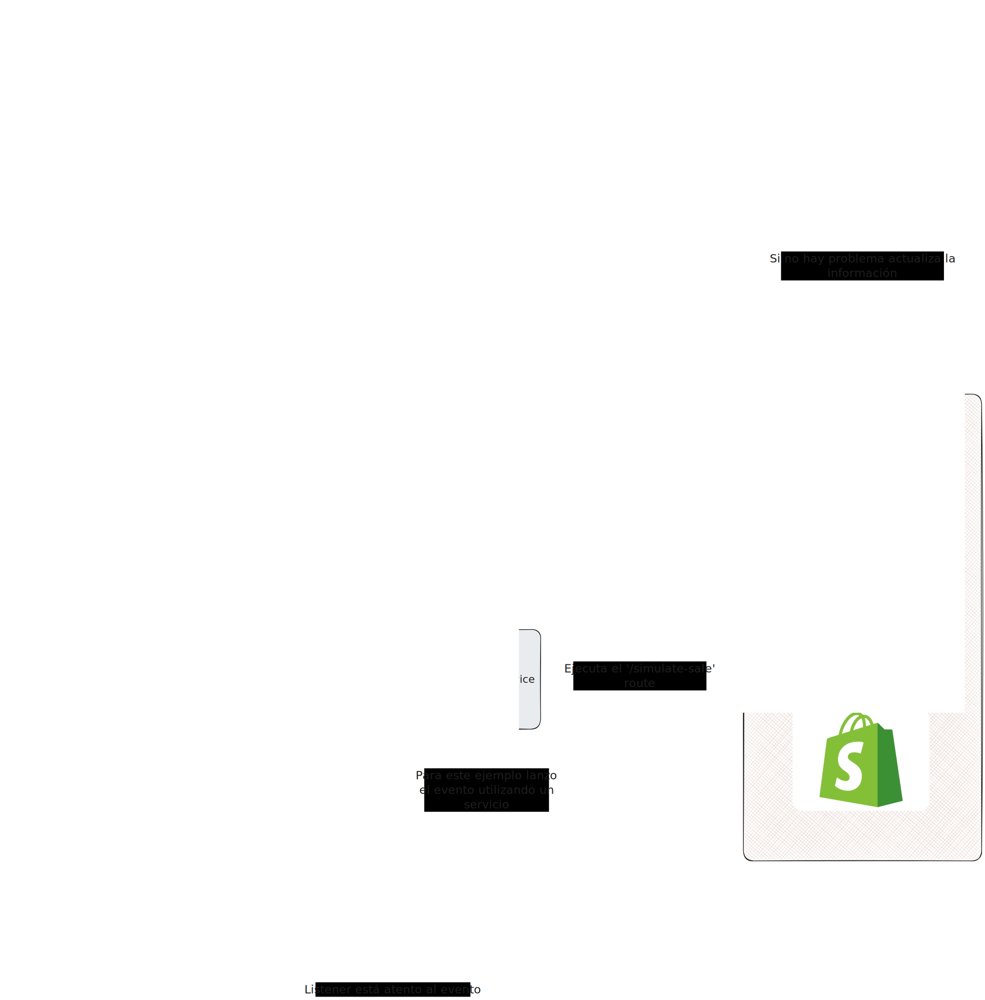

Este proyecto está desarrollado con **Laravel 11** e incluye integración con colas de trabajo para procesar tareas en segundo plano.

---
##  Requisitos previos

Asegúrate de tener instalado:

- PHP 8.3 o superior  
- Composer  
- Git (opcional)
---

## Instalación del proyecto

### 1. Clonar el repositorio o descargar el ZIP

Clona el proyecto usando git:

```bash
git clone https://github.com/xansaul/event-stock.git
````

O descárgalo como `.zip` desde GitHub y descomprímelo.

---
Ir a la carpeta del proyecto
```bash
cd event-stock
```
---
### 2. Instalar dependencias de PHP

Ejecuta:

```bash
composer install
```


### 4. Generar la clave de aplicación

```bash
php artisan key:generate
```

---

### 5. Ejecutar migraciones y seeders

Crea las tablas y datos iniciales:

```bash
php artisan migrate --seed
```

---

### 6. Iniciar el servidor de desarrollo

Ejecuta:

```bash
php artisan serve
```

Esto iniciará el proyecto en
[http://localhost:8000](http://localhost:8000)

---

### 7. Ejecutar las colas de trabajo

En **otra instancia de la terminal**, dentro del mismo proyecto, corre el siguiente comando para procesar las colas:

```bash
php artisan queue:work
```
---
### Diagrama de comportamiento


---

## Verificar el funcionamiento

Una vez que el proyecto esté corriendo correctamente, puedes probar que la sincronización de inventario y la propagación de actualizaciones entre integraciones funcionan como se espera.

### 1. Consultar productos

Ejecuta en el navegador o con una herramienta como Postman o cURL:

```
GET http://localhost:8000/api/products
```

Este endpoint devuelve la lista de productos registrados en la base de datos.
Por defecto, al ejecutar los seeders, el **producto con ID 1** tendrá **25 unidades en stock**.

---

### 2. Simular una venta

Para reducir el stock del producto  1, ejecuta:

```
GET http://localhost:8000/simulate-sale
```

Esto simula una venta y **resta 1 unidad al stock** del producto.

---

### 3. Verificar la actualización

Después de ejecutar la simulación, verifica que el stock del producto 1 se haya reducido a **24 unidades** volviendo a consultar:

```
GET http://localhost:8000/api/products
```

También puedes revisar los logs de Laravel (ubicados normalmente en `storage/logs/laravel.log`)
para confirmar que se propagaron las actualizaciones a las integraciones activas.

Deberías ver algo similar a lo siguiente:

```
[2025-11-10 03:21:47] local.INFO: [Core] PROD-001 actualizado a 24 (por amazon)
[2025-11-10 03:21:49] local.INFO: [Listener] Propagando actualización de PROD-001 (24) desde amazon
[2025-11-10 03:21:49] local.INFO: [Listener] Omitiendo amazon (fuente original)
[2025-11-10 03:21:49] local.INFO: Actualizando stock Mercado Libre: PROD-001 cantidad: 24
[2025-11-10 03:21:49] local.INFO: [Job] Stock sincronizado en MercadoLibre: PROD-001 = 24
[2025-11-10 03:21:49] local.INFO: Actualizando stock Shopify: PROD-001 cantidad: 24
[2025-11-10 03:21:49] local.INFO: [Job] Stock sincronizado en shopify: PROD-001 = 24
```

Esto indica que el sistema:

* Detectó la actualización en la plataforma fuente (Amazon).
* Omitió esa fuente original.
* Propagó correctamente el nuevo stock a las demás integraciones (Mercado Libre y Shopify).

